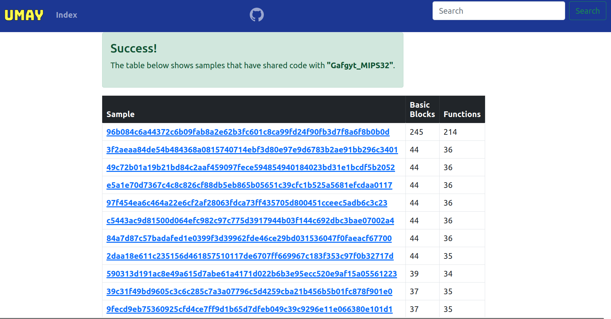

[![Contributors][contributors-shield]][contributors-url]
[![Forks][forks-shield]][forks-url]
[![Stargazers][stars-shield]][stars-url]
[![Issues][issues-shield]][issues-url]


<br />
<p align="center">
  <a href="https://github.com/mucoze/Umay">
    
  </a>

  <h3 align="center">IoT Malware Similarity Analysis Platform</h3>

  <p align="center">
    <a href="#"><strong>View Demo</strong></a>
  </p>
</p>


**Table of contents**

- [About The Project](#about-the-project)
- [Current features](#current-features)
- [Getting Started](#getting-started)
  - [Prerequisites](#prerequisites)
  - [Installation](#installation)
  - [Create your own dataset](#create-your-own-dataset)
- [Contributing](#contributing)
- [License](#license)


## About The Project



This project provides IoT malware similarity analysis based on shared codes. It helps to identify other malwares that have shared code with the analyzed file. In this way, you can have a chance to get an idea about the family of the malware. There are various devices with different architectures in the IoT ecosystem. Static-based methods are more effective when addressing the multi-architecture issue.
1000 malware binaries provided by [IoTPOT](https://sec.ynu.codes/iot/) were used in the project. The basic blocks and functions of each of binaries were extracted by radare2 and the hash values of these data were stored in the SQL database. The basic blocks and functions of the sample to be analyzed are query from this database and all malwares that have shared code are listed.


## Current features

- Shared code based static analysis.
- Supporting ARM, MIPS, x86-64, i386, PowerPC, m68k, Renesas SH.
- ?

## Getting Started

### Prerequisites
- Python3+
- [Radare2](https://github.com/radareorg/radare2)	
  - r2pipe

### Installation

```
git clone https://github.com/mucoze/Umay
cd Umay
```
```bash
virtualenv venv
```
```bash
source venv/bin/activate
```
```bash
pip install -r requirements.txt
```
```bash
python manage.py makemigrations
```
```bash
python manage.py migrate
```
```bash
python manage.py createsuperuser
```
```bash
python manage.py runserver
```

and now project app is accesible from your browser.
Default: `127.0.0.1:8000`


### Create your own dataset file

`python create_dataset.py samples/`

Give the directory where all the samples are located as an argument and it will generate the `dataset.db` file for you.


## 🤝 Contributing

Contributions, issues, and feature requests are welcome!

Feel free to contact me. 


## License
Umay is licensed under [Apache License 2.0](LICENSE)


[contributors-shield]: https://img.shields.io/github/contributors/mucoze/Umay.svg?style=for-the-badge
[contributors-url]: https://github.com/mucoze/Umay/graphs/contributors
[forks-shield]: https://img.shields.io/github/forks/mucoze/Umay.svg?style=for-the-badge
[forks-url]: https://github.com/mucoze/Umay/network/members
[stars-shield]: https://img.shields.io/github/stars/mucoze/Umay.svg?style=for-the-badge
[stars-url]: https://github.com/mucoze/Umay/stargazers
[issues-shield]: https://img.shields.io/github/issues/mucoze/Umay.svg?style=for-the-badge
[issues-url]: https://github.com/mucoze/Umay/issues
